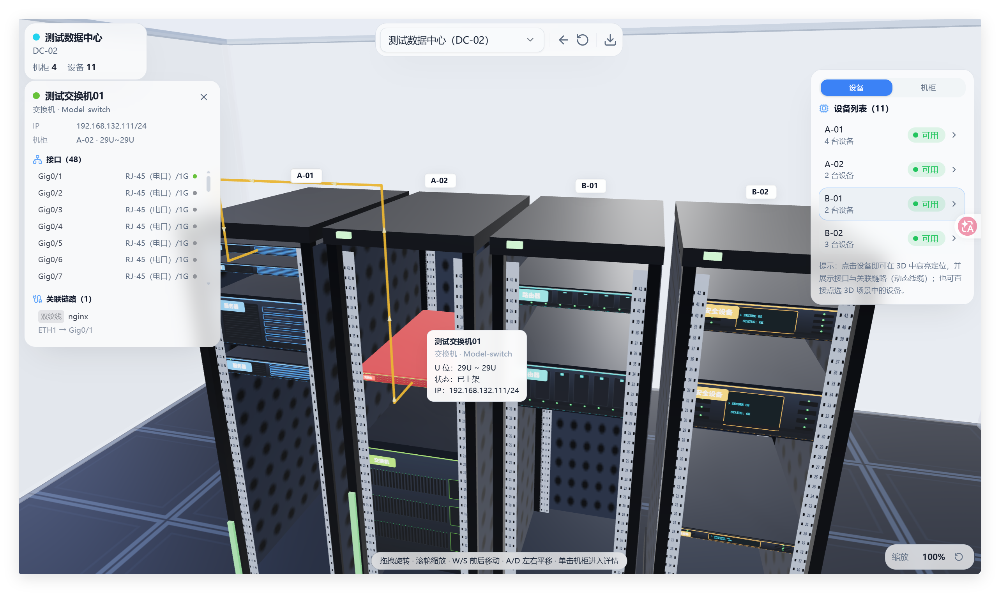

# RackVisio

> 基于 Web 的机房机柜 **3D 可视化工具** —— 把「机房 → 机柜 → 设备 → 上架位置」这类结构化数据，以可交互的三维视图呈现。

---

## 一、项目简介

RackVisio 是一个轻量级的机房机柜三维可视化工具。它把机房、机柜与设备的层级数据，通过 Three.js 渲染成可旋转、可缩放、可点击查看详情的 3D 场景，帮助运维人员直观掌握机柜空间占用与设备分布。



### 定位与适用范围

- ✅ **轻量级**：本地开发零配置——SQLite 单机文件数据库 + 单进程后端 + 进程内缓存，开箱即用，无需安装任何额外中间件；Docker 部署由 `docker-compose.yml` 自带 PostgreSQL，仍保持单服务形态。
- ✅ 适合**中小型机房 / 单数据中心**的空间规划与资产可视化。
- ⚠️ **不适用于超大规模场景**：未实现 Redis 等分布式缓存（缓存为进程内字典，多实例间不共享），不面向多数据中心联邦、海量设备高并发写入等大型部署。需要更大容量时可切换 PostgreSQL，但整体定位仍为轻量工具。

### 功能概览

- 机房 / 机柜 / 设备的增删改查与层级关联
- 设备上架管理（安装位置、U 位、前后面板端口）
- 链路管理（设备接口互联、建链与拓扑视图）
- 耗材管理（类型 → 分类 → 条目，库存出入库与变动记录）
- 2D 机柜视图（U 位矩阵）+ 3D 机房 / 机柜视图（Three.js 第一人称视角）
- 仪表盘统计（机柜使用率、设备类型 / 状态分布）
- 机房 / 机柜平面拓扑 **导出为 draw.io（`.drawio`）**，可在 diagrams.net 中继续编辑（导出在浏览器端完成，无需后端）
- 浅色 / 深色主题切换（shadcn-vue 令牌体系，支持跟随系统）
- 机柜 U 位明细 **导出** 为 Excel（便于打印 / 共享；当前为导出，非导入）
- 登录鉴权（JWT）+ 基于角色的权限控制（RBAC）

---

## 二、技术栈

### 前端

| 类别 | 技术 |
| --- | --- |
| 框架 | Vue 3（`<script setup>` 组合式 API） |
| 构建 | Vite 5 |
| 样式 | Tailwind CSS 3 + shadcn-vue 风格组件（reka-ui） |
| 状态 / 路由 | Pinia 2、vue-router 4（history 模式） |
| 3D 渲染 | Three.js 0.169 |
| 图表 / 拓扑 | ECharts 5（仪表盘）、AntV G6 5（链路拓扑） |
| 表格导出 | ExcelJS 4 |
| 工具库 | lucide-vue-next（图标）、@vueuse/core、class-variance-authority、clsx、tailwind-merge |

### 后端

| 类别 | 技术 |
| --- | --- |
| 语言 | Python ≥ 3.10 |
| Web 框架 | FastAPI + Uvicorn（ASGI） |
| ORM | SQLAlchemy 2.x（异步） |
| 数据库驱动 | aiosqlite（开发默认）/ asyncpg（PostgreSQL 生产） |
| 校验 / 配置 | Pydantic、Pydantic-Settings |
| 可选 | Redis（多实例缓存，默认关闭，使用进程内字典缓存） |

### 基础设施 / 部署

- Docker + Docker Compose：PostgreSQL 16 + 后端 + 前端 Nginx 三容器编排
- 开发态可纯本地运行（SQLite + Vite dev）

---

## 三、环境要求与安装步骤

### 环境要求

- Node.js ≥ 18（推荐 22 LTS）
- Python ≥ 3.10（推荐 3.13）
- 包管理：npm（前端）、pip 或 uv（后端）
- 可选：Docker / Docker Compose（一键部署）

### 方式一：本地运行（开发 / 体验）

**1. 启动后端**

```bash
cd backend
python -m venv .venv && source .venv/bin/activate   # Windows: .venv\Scripts\activate
pip install -r requirements.txt
# 首次启动自动建表并 seed 默认管理员（用户名 admin，密码 admin123）
uvicorn app.main:app --host 0.0.0.0 --port 8000 --reload
```

> 默认使用 SQLite（`backend/idc.db`），无需安装数据库。生产环境设置 `DATABASE_URL=postgresql+asyncpg://用户:密码@主机:5432/库名` 即可切换到 PostgreSQL，业务代码无需改动。

**2. 启动前端**

```bash
cd frontend
npm install
npm run dev            # 开发服务器 http://localhost:5173
# 或构建后预览：
npm run build && npm run preview   # 默认 http://localhost:4173
```

**3. 访问系统**

浏览器打开前端地址，使用 `admin / admin123` 登录。

### 方式二：Docker 一键部署

```bash
cp .env.example .env      # 按需修改数据库密码、JWT 密钥、管理员密码
docker compose up -d      # 首次自动构建镜像
```

部署完成后访问 `http://<宿主机>:8080`（端口由 `.env` 的 `HTTP_PORT` 控制）。详细架构与调优见 `docs/DEPLOY.md`。

---

## 四、使用方法示例

RackVisio 的数据通过 **Web 界面或 REST API** 录入，3D 视图实时读取数据库渲染。下面以界面操作为例，演示「录入机柜数据 → 生成 3D 视图」的完整流程。

> **关于 Excel**：当前版本 Excel 用于**导出**机柜 U 位明细（打印 / 共享），数据录入通过界面表单或 API 完成，**暂不支持直接导入 Excel**。如需批量录入，可调用 `/api/v1` 各模块接口（开发态访问 `/docs` 查看 OpenAPI 文档）。

**步骤 1 · 登录**
使用默认管理员 `admin / admin123` 登录系统（生产环境请务必修改密码与 `SECRET_KEY`）。

**步骤 2 · 新建机房**
进入「机房管理」→「新建机房」，填写名称、位置等信息并保存。

**步骤 3 · 新建机柜**
在该机房下「新建机柜」，设置机柜名称、总 U 数（如 42U）、列 / 行坐标等。

**步骤 4 · 录入设备并上架**
进入「设备管理」新建设备（名称、类型、状态等）；在设备详情中执行「上架」，选择目标机柜与起始 U 位，确认后设备即占用对应 U 位。

**步骤 5 · 查看 3D 视图**
- **3D 机房视图**：以第一人称视角纵览整个机房 —— 左键拖拽原地旋转、滚轮缩放、`W/S` 前后移动、`↑/↓` 垂直平移、`A/D`（或 `←/→`）左右平移。
- **3D 机柜视图**：聚焦单台机柜，查看设备占用的 U 位排布。
- 点击设备模型可查看详情（设备编码、开关机状态、端口等）。

**步骤 6（可选）· 导出 Excel**
在「机柜 2D 视图」点击「导出 Excel」，可将机柜 U 位明细（含设备类型着色、合并单元格、悬停批注）导出为 `.xlsx`，用于汇报或打印。

**步骤 7（可选）· 导出 draw.io 拓扑**
在「3D 机房视图」点击「导出机房拓扑为 draw.io」，可将机房内机柜与设备的平面拓扑（含类型专属图形）导出为 `.drawio` 文件；导入 [diagrams.net](https://www.diagrams.net) 后即可继续编辑、补充连线与标注。该导出完全在浏览器端由 `utils/drawio.js` 完成，不依赖后端。

**主题切换**
右上角主题按钮可在浅色 / 深色 / 跟随系统之间切换；所有页面与组件均基于 shadcn-vue CSS 变量令牌适配，切换即时无闪烁。

**API 接口文档**
除 Web 界面外，所有数据操作均通过 REST API 完成。后端基于 FastAPI 自动生成交互式文档，启动后可直接访问：
- Swagger UI：`http://localhost:8000/docs`
- ReDoc：`http://localhost:8000/redoc`
- OpenAPI JSON：`http://localhost:8000/openapi.json`

如需离线 / 精简的接口速查（按模块列出全部端点），参见 [`docs/API.md`](./docs/API.md)。

---

## 五、项目目录结构

```
RackVisio/
├── backend/                      # 后端（FastAPI）
│   ├── app/
│   │   ├── api/v1/               # REST 路由（room/rack/device/interface/link/consumable/account/auth…）
│   │   ├── core/                 # 配置、安全、RBAC、展示元数据单一源（meta.py）
│   │   ├── db/                   # 数据库引擎、会话、init_db（建表 + seed + 版本化迁移）
│   │   ├── models/               # SQLAlchemy ORM 模型（集中注册）
│   │   ├── repositories/         # 数据访问层
│   │   ├── schemas/              # Pydantic 请求 / 响应模型
│   │   ├── services/             # 业务逻辑层
│   │   └── main.py               # 应用入口（AuthMiddleware + 路由挂载）
│   ├── requirements.txt          # Python 依赖
│   ├── pyproject.toml            # 项目元数据
│   └── Dockerfile                # 后端镜像
├── frontend/                     # 前端（Vue 3 + Vite）
│   ├── src/
│   │   ├── api/                  # axios 封装与各模块 API 客户端
│   │   ├── components/           # 公共 / 设备 / 机柜 / 机房 / 3D 组件
│   │   │   ├── three/            # 3D 相关组件（Room3DView / Rack3DView）
│   │   │   └── ui/               # shadcn-vue 风格基础组件
│   │   ├── composables/          # 组合式函数（useToast 等）
│   │   ├── router/               # vue-router（history 模式）
│   │   ├── stores/               # Pinia 状态（auth / meta 等）
│   │   ├── utils/                # 工具（three-setup.js：3D 引擎初始化；drawio.js：导出 .drawio 拓扑）
│   │   ├── views/                # 页面（dashboard/room/rack/device/link/three…）
│   │   └── styles/               # 全局样式
│   ├── package.json
│   ├── vite.config.js
│   └── Dockerfile                # 前端镜像（Nginx 托管 + 反代 API）
├── docker-compose.yml            # 三容器编排：PostgreSQL + 后端 + 前端
├── docs/
│   ├── DEPLOY.md                 # Docker 部署指南
│   └── API.md                    # REST API 接口速查（按模块列端点）
├── .env.example                  # 环境变量模板
├── LICENSE                       # 开源许可证（MIT）
└── README.md
```

---

## 六、开源许可证

本项目采用 **MIT License** 开源协议，允许在遵守许可证条款的前提下自由使用、修改与分发。

完整条款见仓库根目录的 [`LICENSE`](./LICENSE) 文件。如需采用其他许可证（如 Apache-2.0、GPL 等），请替换 `LICENSE` 文件并同步更新本说明。

---

> 文档如有过时或与实际行为不符之处，欢迎指正。
