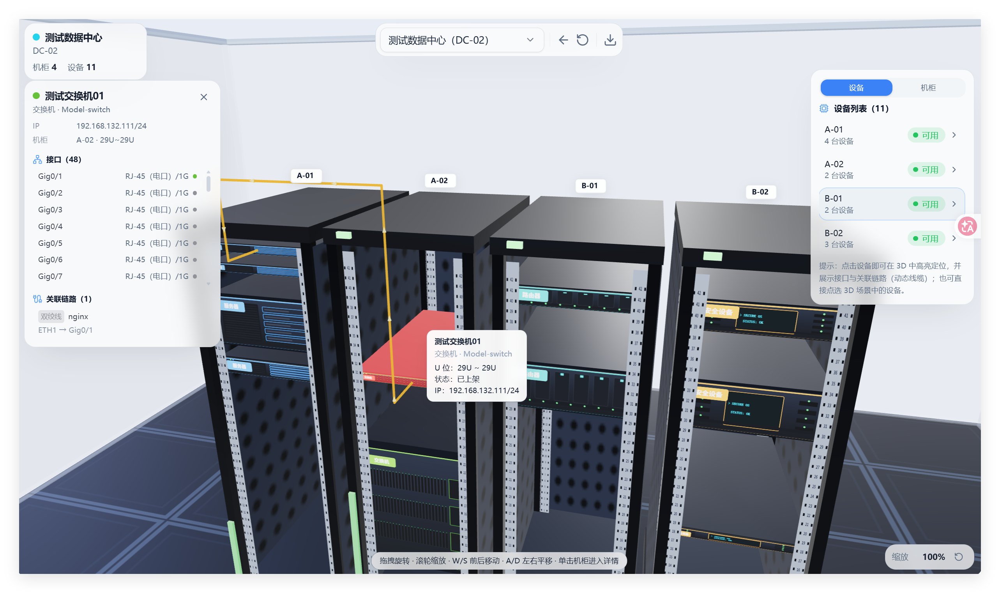

# RackVisio

> 基于 Web 的机房机柜 **3D 可视化工具** —— 把「机房 → 机柜 → 设备 → 上架位置」这类结构化数据，以可交互的三维视图呈现，帮助运维人员直观掌握机柜空间占用与设备分布。

---

## 目录

- [一、项目简介](#一项目简介)
- [二、核心功能](#二核心功能)
- [三、技术栈](#三技术栈)
- [四、环境要求与安装](#四环境要求与安装)
- [五、使用方法](#五使用方法)
- [六、项目目录结构](#六项目目录结构)
- [七、相关文档](#七相关文档)
- [八、开源许可证](#八开源许可证)

---

## 一、项目简介

RackVisio 是一个轻量级的机房机柜三维可视化与资产管理工具。它将机房、机柜、设备的层级数据通过 Three.js 渲染成可旋转、可缩放、可点击查看详情的 3D 场景，并配套完整的 2D 视图、仪表盘与 REST API。



### 定位与适用范围

- ✅ **轻量级**：本地开发零配置——SQLite 单机文件数据库 + 单进程后端 + 进程内缓存，开箱即用，无需安装额外中间件；Docker 部署由 `docker-compose.yml` 自带 PostgreSQL + Redis，仍保持单服务形态。
- ✅ 适合 **中小型机房 / 单数据中心**的空间规划与资产可视化。
- ❌ 不适合多数据中心异地容灾、集群级高可用等场景（属单体架构，扩展方向见 [`docs/DEPLOY.md`](./docs/DEPLOY.md)）。

---

## 二、核心功能

| 功能域 | 说明 |
| --- | --- |
| **资产建模** | 机房 / 机柜 / 设备增删改查与层级关联；设备上架管理（U 位、前后面板端口） |
| **3D 可视化** | 机房 3D 视图（Three.js 第一人称漫游）+ 机柜 3D 视图 + 2D U 位矩阵视图 |
| **平面拓扑** | 机房平面图内嵌视图（机柜排布、占用、拖拽调整位置）；导出 draw.io（`.drawio`）可编辑 |
| **链路管理** | 设备接口互联、建链 / 断链、孤儿口（未连线接口）识别 |
| **耗材管理** | 耗材类型 → 分类 → 条目三级结构，库存出入库与变动记录 |
| **基础设施** | 配线架 / ODF 配线架 / 其他设施（占 U 位但不计入资产、不建接口） |
| **仪表盘** | 机柜使用率、设备类型 / 状态分布、功率预算等统计 |
| **导入导出** | 机房 / 机柜 / 设备列表 Excel 导入导出；机柜 U 位明细导出 `.xlsx`（浏览器端完成） |
| **审计日志** | 请求级操作日志（`operation_logs`）+ 登录日志（`login_logs`），双二级菜单展示 |
| **安全** | JWT 登录鉴权 + RBAC 权限控制（`module:view` / `module:edit` 粒度）；登录限流、密码强制改密 |
| **体验** | 浅色 / 深色 / 跟随系统主题切换；全局搜索；响应式布局 |

---

## 三、技术栈

### 前端

| 类别 | 技术 |
| --- | --- |
| 框架 | Vue 3.5（`<script setup>` 组合式 API） |
| 构建 | Vite 8 |
| 样式 | Tailwind CSS 4（CSS-first `@theme` 令牌体系）+ shadcn-vue 风格组件（reka-ui） |
| 状态 / 路由 | Pinia 4、vue-router 5（history 模式） |
| 3D 渲染 | Three.js 0.185 |
| 图表 | ECharts 6（按需引入，仪表盘） |
| 表格 | @tanstack/vue-virtual（虚拟滚动）+ ExcelJS 4（导出） |
| 工具库 | lucide-vue-next（图标）、class-variance-authority、clsx、tailwind-merge |

### 后端

| 类别 | 技术 |
| --- | --- |
| 语言 | Python ≥ 3.10（推荐 3.12+） |
| Web 框架 | FastAPI + Uvicorn（ASGI） |
| ORM | SQLAlchemy 2.x（异步） |
| 数据库 | aiosqlite（本地开发）/ asyncpg + PostgreSQL 16（Docker 生产） |
| 校验 / 配置 | Pydantic v2、Pydantic-Settings |
| 缓存 | Redis（看板 / 统计缓存，默认开启；不可达自动降级进程内字典） |
| 依赖管理 | uv（`uv.lock` 锁版本） |

### 部署

- Docker Compose 四容器编排：PostgreSQL 16 + Redis 7.4 + 后端（Python 3.12）+ 前端（Nginx）
- 开发态可纯本地运行（SQLite + Vite dev server）

---

## 四、环境要求与安装

### 环境要求

| 依赖 | 版本要求 | 说明 |
| --- | --- | --- |
| Node.js | ≥ 24 | 配套 Vite 8 |
| Python | ≥ 3.10（推荐 3.12） | 后端运行环境 |
| 包管理 | npm（前端）/ uv（后端，亦可用 pip + venv） | |
| Docker | 可选 | 一键部署（需 Docker Engine + Compose v2） |

### 方式一：本地运行（开发 / 体验）

**0. 获取源码**（GitHub 或国内 Gitee 二选一）

```bash
# GitHub
git clone https://github.com/alkaid999/RackVisio.git
# 国内加速（Gitee 镜像）
git clone https://gitee.com/alkaid_yang/RackVisio.git

cd RackVisio
```

**1. 启动后端**

```bash
cd backend
# 推荐 uv（自动建 .venv 并依据 pyproject + uv.lock 安装依赖）
uv sync
# 传统方式亦可：
#   python -m venv .venv && source .venv/bin/activate   # Windows: .venv\Scripts\activate
#   pip install -r requirements.txt
# 首次启动自动建表并 seed 默认管理员（用户名 admin，密码 admin123）
uvicorn app.main:app --host 0.0.0.0 --port 8000 --reload
```

> 默认使用 SQLite（`backend/idc.db`），无需安装数据库。生产环境设置 `DATABASE_URL=postgresql+asyncpg://用户:密码@主机:5432/库名` 即可切换到 PostgreSQL，业务代码无需改动。

**2. 启动前端**

```bash
cd frontend
npm install
npm run dev            # 开发服务器 http://localhost:5173
# 或构建后预览：
npm run build && npm run preview   # 默认 http://localhost:4173
```

**3. 访问系统**

浏览器打开前端地址，使用 `admin / admin123` 登录（首次登录会被强制要求修改密码）。

### 方式二：Docker 一键部署

**0. 获取源码**（同上，GitHub 或 Gitee）

**1. 准备环境变量**

```bash
cp .env.example .env      # 按需修改数据库密码、JWT 密钥
```

> ⚠️ **生产环境必须修改 `SECRET_KEY`**：Docker 部署默认 `ENVIRONMENT=production`，后端启动时若 `SECRET_KEY` 仍为默认值将 **fail-closed 拒绝启动**，这是安全基线（S-01）。生成强密钥：
> ```bash
> SECRET_KEY=$(openssl rand -hex 32)
> ```

**2. 构建并启动**

```bash
docker compose up -d --build      # 首次自动构建镜像
```

部署完成后访问 `http://<宿主机>:8080`（端口由 `.env` 的 `HTTP_PORT` 控制）。完整架构与运维细节见 [`docs/DEPLOY.md`](./docs/DEPLOY.md)。

**3. 更新已部署的项目**

代码在构建时打进镜像，因此更新部署 = **先拉取最新源码，再重新构建并启动**；数据保存在数据库卷中，更新过程无需删除卷、无需从备份恢复：

```bash
git pull                             # 拉取最新代码（Gitee 镜像同理）
docker compose up -d --build         # 重新构建 backend / frontend 镜像并启动
```

- ⚠️ 不要用 `docker compose down -v` 来「更新」——`-v` 会删除数据卷、清空所有数据；那属于「重置整个系统」（见 `docs/DEPLOY.md` 第五节）。
- 修改 `.env` 后必须 `docker compose down && docker compose up -d --build` 才能重新加载。

**4. Redis 缓存（默认开启，可选关闭）**

- **Docker 部署**：`docker-compose.yml` 自带 `redis` 服务（`redis:7.4-alpine` + 持久化卷），后端 `REDIS_ENABLED=true`，开箱即用。
- **本地开发**：默认 `REDIS_ENABLED=true`、连接 `redis://127.0.0.1:6379/0`；本机已运行 Redis 则立即生效。
- **自动降级**：若 Redis 不可达，缓存层自动回源数据库，接口照常返回，不报错、不影响功能（启动日志首行打印 `Cache backend:` 状态）。

缓存内容为看板与统计类聚合结果（键名 `dashboard:overview`、`room_stats:{room_id}` 等，TTL 由 `CACHE_TTL` 默认 30 秒控制）；写操作自动失效对应缓存键。运维细节见 [`docs/DEPLOY.md`](./docs/DEPLOY.md) 第七节。

---

## 五、使用方法

RackVisio 的数据通过 **Web 界面或 REST API** 录入，3D 视图实时读取数据库渲染。下面以界面操作为例演示「录入数据 → 生成 3D 视图」的完整流程。

> **关于 Excel**：机柜 U 位明细可**导出**为 `.xlsx`（打印 / 共享，含设备类型着色、合并单元格、悬停批注）；机房 / 机柜 / 设备列表也支持**导入** `.xlsx`（浏览器端解析、逐行校验，单行错误不影响其他行）。批量录入亦可调用 `/api/v1` 各模块接口（开发态访问 `/docs` 查看 OpenAPI 文档）。

**步骤 1 · 登录**：使用默认管理员 `admin / admin123` 登录（生产环境请务必修改密码与 `SECRET_KEY`）。

**步骤 2 · 新建机房**：进入「机房管理」→「新建机房」，填写名称、位置等信息并保存。

**步骤 3 · 新建机柜**：在该机房下「新建机柜」，设置机柜名称、总 U 数（如 42U）、列 / 行坐标等。

**步骤 4 · 录入设备并上架**：进入「设备管理」新建设备（名称、类型、状态等）；在设备详情中执行「上架」，选择目标机柜与起始 U 位，确认后设备即占用对应 U 位。

**步骤 5 · 查看 3D 视图**：

- **3D 机房视图**：第一人称视角纵览整个机房——左键拖拽旋转、滚轮缩放、`W/S` 前后移动、`↑/↓` 垂直平移、`A/D`（或 `←/→`）左右平移。
- **3D 机柜视图**：聚焦单台机柜，查看设备占用的 U 位排布。
- 点击设备模型可查看详情（设备编码、开关机状态、端口等）。

**步骤 6（可选）· 导出 Excel**：在「机柜 2D 视图」点击「导出 Excel」，将机柜 U 位明细导出为 `.xlsx`（含设备类型着色、合并单元格、悬停批注）。

**步骤 7（可选）· 导出 draw.io 拓扑**：在「机房平面图」点击「导出拓扑为 draw.io」，将机柜与设备的平面拓扑（含类型专属图形）导出为 `.drawio`；导入 [diagrams.net](https://www.diagrams.net) 后即可继续编辑。该导出完全在浏览器端由 `utils/drawio.js` 完成，不依赖后端。

**主题切换**：右上角主题按钮可在浅色 / 深色 / 跟随系统之间切换；所有页面与组件基于 CSS 变量令牌适配，切换即时无闪烁。

**API 接口文档**：后端基于 FastAPI 自动生成交互式文档，启动后可直接访问：

- Swagger UI：`http://localhost:8000/docs`
- ReDoc：`http://localhost:8000/redoc`
- OpenAPI JSON：`http://localhost:8000/openapi.json`

离线 / 精简的接口速查（按模块列出全部端点、参数与错误码），参见 [`docs/API.md`](./docs/API.md)。

---

## 六、项目目录结构

```
RackVisio/
├── backend/                      # 后端（FastAPI）
│   ├── app/
│   │   ├── api/v1/               # REST 路由（rooms/racks/devices/interfaces/links/
│   │   │                         #   consumables/mount_records/accounts/auth/stats/meta/logs）
│   │   ├── core/                 # 配置（config.py）、安全、RBAC、缓存门面（cache.py）、meta.py
│   │   ├── db/                   # 数据库引擎、会话、init_db（建表 + seed + 迁移）
│   │   ├── models/               # SQLAlchemy ORM 模型（集中注册）
│   │   ├── repositories/         # 数据访问层
│   │   ├── schemas/              # Pydantic 请求 / 响应模型
│   │   ├── services/             # 业务逻辑层（含仪表盘、导入导出、耗材等）
│   │   └── main.py               # 应用入口（中间件链 + 路由挂载）
│   ├── tests/                    # pytest 测试
│   ├── requirements.txt          # Python 依赖（pip 方式）
│   ├── pyproject.toml / uv.lock  # uv 依赖锁定
│   └── Dockerfile                # 后端镜像
├── frontend/                     # 前端（Vue 3 + Vite）
│   ├── src/
│   │   ├── api/                  # axios 封装与各模块 API 客户端
│   │   ├── components/           # 公共 / 设备 / 机柜 / 机房 / 3D / UI 组件
│   │   │   ├── ui/               # shadcn-vue 风格基础组件（button/dialog/form…）
│   │   │   └── three/            # 3D 场景内覆盖组件
│   │   ├── composables/          # 组合式函数（useTheme/useToast/useConfirm/usePersistentFilter…）
│   │   ├── router/               # vue-router（history 模式）
│   │   ├── stores/               # Pinia 状态（auth/meta/device/room/rack/consumable）
│   │   ├── utils/                # 工具（echarts-core 按需引入、drawio 导出、constants 令牌）
│   │   ├── views/                # 页面（dashboard/room/rack/device/link/consumable/account/log/three）
│   │   └── styles/               # 全局样式与设计令牌（index.css）
│   ├── package.json
│   ├── vite.config.js
│   ├── nginx.conf                # 生产 Nginx 配置（SPA 回退 + API 反代）
│   └── Dockerfile                # 前端镜像（多阶段：Node 构建 → Nginx 托管）
├── docker-compose.yml            # 四容器编排：PostgreSQL + Redis + 后端 + 前端
├── docs/
│   ├── API.md                    # REST API 接口速查（端点 / 参数 / 示例 / 错误码）
│   └── DEPLOY.md                 # Docker 部署与运维指南（面向运维学习）
├── .env.example                  # 环境变量模板
├── LICENSE                       # 开源许可证（MIT）
└── README.md
```

---

## 七、相关文档

| 文档 | 内容 | 适用对象 |
| --- | --- | --- |
| [`docs/API.md`](./docs/API.md) | 全部 REST 端点、参数说明、返回示例、错误码定义 | 开发 / 集成 |
| [`docs/DEPLOY.md`](./docs/DEPLOY.md) | 部署环境要求、配置步骤、启动流程、故障排查（运维学习指南） | 运维 / 部署 |

---

## 八、开源许可证

本项目采用 **MIT License** 开源协议，允许在遵守许可证条款的前提下自由使用、修改与分发。

完整条款见仓库根目录的 [`LICENSE`](./LICENSE) 文件。如需采用其他许可证（如 Apache-2.0、GPL 等），请替换 `LICENSE` 文件并同步更新本说明。

---

> 文档如有过时或与实际行为不符之处，欢迎指正。

---

> 文档版本：2026-08-01 ｜ 相关文档：[`docs/API.md`](./docs/API.md)（接口速查）｜ [`docs/DEPLOY.md`](./docs/DEPLOY.md)（部署与运维指南）
